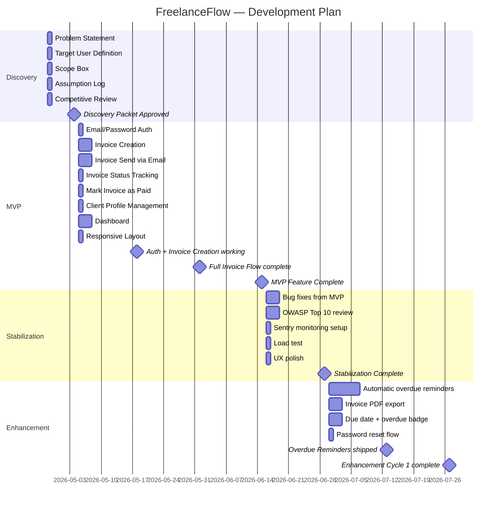

# Project Plan — FreelanceFlow
_Generated: 2026-04-27 09:30_

> **Note:** This is a sample output from `scripts/project_planner.py`. It uses a fictional invoice management app called **FreelanceFlow** to demonstrate the format and depth of output you can expect.

## Overview
- **Start Date:** 2026-04-28
- **Team Size:** 1 developer
- **Tech Stack:** Next.js, Supabase, Tailwind CSS, Vercel
- **Total Duration:** 13 weeks

---

## Phase Timeline

| Phase | Start Week | End Week | Duration | Goal |
|---|---|---|---|---|
| Discovery | Week 1 | Week 1 | 1w | Validate the problem and lock scope before writing any code |
| MVP | Week 2 | Week 7 | 6w | Ship the smallest working invoicing app real freelancers can use |
| Stabilization | Week 8 | Week 9 | 2w | Fix MVP bugs, harden security, add monitoring |
| Enhancement | Week 10 | Week 13 | 4w | Layer in Should Have features driven by alpha user feedback |

---

## Discovery (Week 1–1)
**Goal:** Validate the problem and lock scope before writing any code  
**Team:** 1 person  
**Purpose:** De-risk the idea before writing code.  
**Priority Rule:** No code is written. Documentation and validation only.

### Features

| Feature | Priority | Effort | Rationale |
|---|---|---|---|
| Problem Statement | Must Have | XS | Defines what we are solving and who for |
| Target User Definition | Must Have | XS | Without a clear user, every decision is a guess |
| Scope Box (In/Out) | Must Have | XS | Prevents scope creep before a line of code is written |
| Assumption Log | Must Have | XS | Every assumption is a risk — log them before they break the architecture |
| Competitive Review (3 tools) | Should Have | S | Understand what exists so we don't replicate it |

### Milestones

- **Week 1 — Discovery Packet Approved:** Problem statement, target user, scope box, and assumption log are signed off. Dev work can begin.

### Risks

- ⚠ Discovery is skipped to "save time" — leads to building the wrong thing and expensive rework in Week 4+
- ⚠ Scope is left undefined — every conversation with a stakeholder adds a new "must have" feature

### Exit Decision Point
> Has the problem been validated with at least 3 real freelancers who confirm they have this pain and would use a solution?

**Standard exit criteria:** Stakeholders have approved the Discovery Packet and dev team understands scope.

---

## MVP (Week 2–7)
**Goal:** Ship the smallest working invoicing app that real freelancers can use end-to-end  
**Team:** 1 developer  
**Purpose:** Build the smallest version that proves core value to real users.  
**Priority Rule:** Only Must Have features. Every Should Have or Could Have is deferred.

### Features

| Feature | Priority | Effort | Rationale |
|---|---|---|---|
| Email/Password Auth (Supabase) | Must Have | S | Users must have accounts before any personal data can be stored |
| Invoice Creation (line items, totals) | Must Have | M | Core function — without this the app has no purpose |
| Invoice Send via Email (PDF attachment) | Must Have | M | Sending is the primary action users need to take |
| Invoice Status Tracking (Draft/Sent/Paid) | Must Have | S | Users need to know what's happened to each invoice |
| Mark Invoice as Paid | Must Have | XS | Completes the core workflow |
| Client Profile Management | Must Have | S | Eliminates repetitive data entry, key to adoption |
| Dashboard (total invoiced, paid, outstanding) | Must Have | M | Gives users the at-a-glance view they cannot get from a spreadsheet |
| Responsive Layout (mobile-friendly) | Must Have | S | Freelancers check payment status on phones |

### Milestones

- **Week 3 — Auth + Invoice Creation working:** A user can register, log in, and save a draft invoice.
- **Week 5 — Full Invoice Flow complete:** A user can create, send, and mark an invoice as paid end-to-end.
- **Week 7 — MVP Feature Complete:** All Must Have features are working. Internal testing begins.

### Risks

- ⚠ Email delivery reliability — Resend free tier has sending limits; test early
- ⚠ PDF generation complexity — browser-based PDF (e.g. React-PDF) may have layout edge cases; spike in Week 2
- ⚠ Solo developer velocity — no buffer for illness or blockers; keep scope tight

### Exit Decision Point
> Can a real user (not the developer) create an account, create an invoice, send it to a client email, and mark it paid — without asking for help?

**Standard exit criteria:** A real user can complete the core workflow without help from the dev team.

---

## Stabilization (Week 8–9)
**Goal:** Fix what MVP revealed. Harden security, fix bugs, add monitoring.  
**Team:** 1 developer  
**Purpose:** Harden what MVP revealed. Fix bugs, improve performance, tighten UX.  
**Priority Rule:** No new features. Reliability and security only.

### Features

| Feature | Priority | Effort | Rationale |
|---|---|---|---|
| Bug fixes from MVP testing | Must Have | M | Alpha testers found 8 issues — all P1/P2 must be resolved |
| OWASP Top 10 review | Must Have | M | Security hardening before sharing with external alpha users |
| Sentry error monitoring setup | Must Have | S | Cannot operate blind in production |
| Load test (simulate 200 users) | Must Have | S | Validate Supabase free tier holds under real load |
| UX polish (empty states, error messages) | Should Have | S | First impressions matter for alpha retention |

### Milestones

- **Week 9 — Stabilization Complete:** Zero P1 bugs, Sentry live, load test passed. App is ready for alpha invites.

### Risks

- ⚠ A security issue found in OWASP review delays alpha launch — allocate a full day for remediation
- ⚠ Sentry noise from unhandled edge cases — set up alert thresholds before going live

### Exit Decision Point
> Does the app pass the OWASP review, load test, and have zero known P1/P2 bugs?

**Standard exit criteria:** App passes load test, no P1/P2 bugs, monitoring is live.

---

## Enhancement (Week 10–13)
**Goal:** Layer in Should Have features based on real alpha user feedback  
**Team:** 1 developer  
**Purpose:** Layer in Should Have features based on real user feedback from MVP.  
**Priority Rule:** Feature additions driven by user feedback data, not assumptions.

### Features

| Feature | Priority | Effort | Rationale |
|---|---|---|---|
| Automatic overdue reminder emails | Should Have | L | Top-requested feature from alpha — eliminates manual follow-up |
| Invoice PDF export (download) | Should Have | M | Alpha users asked to keep a local copy of sent invoices |
| Due date on invoices + overdue badge | Should Have | M | Users want clients to see a clear payment deadline |
| Password reset flow | Should Have | S | 3 alpha users hit this — deferred from MVP but now blocking |
| Invoice number prefix customisation | Could Have | S | Nice-to-have branding feature; include if time allows |

### Milestones

- **Week 11 — Overdue Reminders shipped:** Automated email reminders working and tested.
- **Week 13 — Enhancement Cycle 1 complete:** All Should Have features from alpha feedback shipped. Ready for Beta planning.

### Risks

- ⚠ Feature creep from alpha feedback — every request goes through MoSCoW before touching the backlog
- ⚠ Email reminder timing logic — edge cases around timezones, DST; test thoroughly

### Exit Decision Point
> Has user satisfaction (measured by a short survey) improved compared to MVP exit? Are the top 3 alpha feedback items resolved?

**Standard exit criteria:** User satisfaction score improved. Key Should Have features shipped.

---

_Plan generated by Business and Project Consultant skill._  
_Review this plan with the full team before sprint planning begins._

---

## Gantt Chart (Mermaid)

